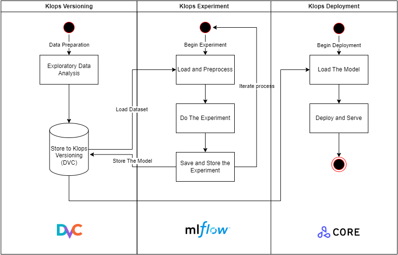

# KLopsEc: Koin MLOps Ecosystems
## Overview  

This repo contains templates to build End-to-End Machine Learning Ops Using Below Stacks:  
- Remote Storage engines (such as GCS, S3, Azure Storage, etc.)  
- Data Versioning Tool: [DVC](https://dvc.org) by iterative.ai  
- [Mlflow](https://mlflow.org) A Machine Learning research lifecycle tool  
- [Seldon](https://www.seldon.io/solutions/open-source-projects/core): An Opensource Kubernetes Framework to deploy machine learning models.  

The Flow diagram below shows how we utilize Klops Ecosystems in our Data Science lifecycle.  

  

## Installation  
### Installing Core Environment  
- Clone this repo: `git clone https://gitlab-engineering.koinworks.com/data-team/klopsec.git`
- Change directory to this repo's root folder: `cd klopsec`
- Connect to your Kubernetes cluster. E.g (using GKE): `gcloud container clusters get-credentials $CLUSTER_NAME --region $REGION --project $PROJECT_NAME`  
- run: `./install.sh`
- The MLflow Tracking Server would serve under port `5000` and The Seldon Core Deployment under port `80`

### Installing Prometheus Pod Monitoring  
- run: `./install_monitoring.sh`  
- It will serve under port `9090`.

## Accessing the APIs  
TODO:  
- Create documentation for accessing the Seldon Rest API.  
- Create documentation for connecting to MLflow Tracking Server within code.

## Accessing the UIs
- Create documentation for accessing the Seldon Core Model API Swagger.
- Create documentation for accessing the MLFlow Tracking Server UI Dashboard.

## Roadmap  
- [x] Integrate MLflow Tracking Server within the cluster  
- [x] Adding support for Pod Monitoring
- [ ] Implement Authentication for MLflow Tracking Server  
- [ ] Implement Authentication for Seldon Core  
- [ ] Adding support for Https (TLS) connections  
- [ ] Integrate with Model monitoring service  
- [ ] Implement A/B Testing mechanism.  

## Contributing  
- Be Koinworks Data Engineer Team member.
- Ask for repository ownership rights (developer or maintainer) to the DevOps Team.
- Start developing by creating a new branch.
- Do your changes / features.
- Ask for a merge request to the staging branch with a reviewer described in your merge request.  

## Authors and acknowledgment
This repository were authored by Koinworks Data Engineers Team.

## License
Apache License, Version [2.0](https://www.apache.org/licenses/LICENSE-2.0).
